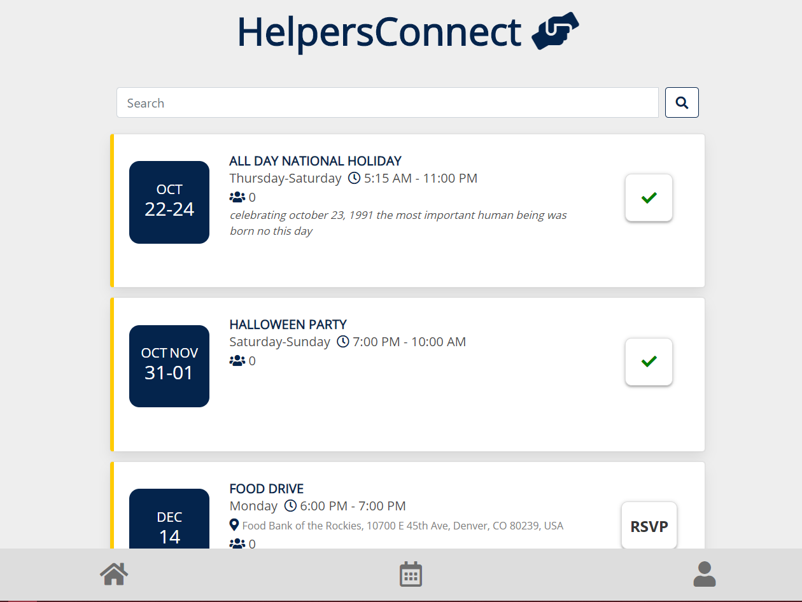

# HelpersConnect


### Deployed App: https://helpers-connect.herokuapp.com/

## Description

An application for community service-based organizations to manage events and volunteers.


## Table of Contents

- [Features](#features)
- [Installation](#installation)
- [Deployment](#deployment)
- [Screenshots](#screenshots)
- [Future Enhancements](#future-enhancements)
- [Credits](#Credits)
- [Contributors](#contributors)

## Features

- One Admin can control the events that appear directly from a Google Calendar
- Attendees are tracked using their Google accounts
- Mobile-responsive design
- Volunteers can mark if they are attending the event
- Search and filter through events

## Installation

#### Cloning repo

> 1. Fork repo
> 2. Clone to local machine

#### Initial Setup (proxy for development/testing locally)

> 3. `npm i` to install packages
> 4. Uncomment out the code in `/client/src/setupProxy.js`
> 5. Add `"proxy": "http://localhost:3001",` to `/client/package.json`

#### OAuth

> 6. Setup OAuth app on in Google
> 7. Set HomepageURL to http://localhost:3000
> 8. Set Authorization callback URL to http://localhost:3000/auth/github/callback
> 9. Update client id and client secret from OAuth app in in `config/keys.js`

#### Google Calendar Setup

> 10. Create a public Google Calendar that will be used solely to display organization events
> 11. In `client/src/pages/Calendar.js` update the email in `getEvents()` to be your Google account
>
> ```
> return gapi.client.request({
> path: `https://www.googleapis.com/calendar/v3/calendars/prettyawesomepractice007@gmail.com/events?singleEvents=true`,
> });
> ```

#### MongoDB

> 12. Robo3T or another MongoDB GUI a prerequsite for this application
> 13. Can run `npm run seed` to seed the database

#### Running app

> 14. `npm start`
> 15. Navigate to http://localhost:3000/auth/google
> 16. Enter Google credentials to authenticate

#### Validation

> 17. Verify a string of letter and numbers appear in the URL
> 18. Validate the user information is available in the `user` collection in the database

#### Optional Styling

> 19. In `/client/src/index.css` can update the primary and accent hex codes:
>
> ```
> :root {
>  --primary-color: #04244c;
>  --accent-color: #ffcb05;
> }
> ```

## Deployment

_Deployment instructions coming soon_

## Screenshots

 

## Future Enhancements

- Convert template to use content management system
- View only for unauthenticated users + sign in link
- Added security via cookies
- Remove API key exposure
- Better handling for "all day" events
- User can decline event
- Announcements page
- Admin Backend
- Better mobile-responsiveness
- Convert to React Native
- Convert to PWA
- Push Notifications
- Sync event to user's calendar
- Send responses to Admin's calendar
- See events attending on volunteer profile

## Credits

- [React](https://reactjs.org/)

- [Reactstrap](https://reactstrap.github.io/)

- [Bulma](bulma.io)

- [Bootstrap](https://getbootstrap.com/)

- [styled-components](https://styled-components.com/docs)

- [OAuth for Google](https://developers.google.com/identity/protocols/oauth2)

- [Google Calendar API](https://developers.google.com/calendar)

- [Mongoose](https://mongoosejs.com/)

- [MongoDB](https://www.mongodb.com/)

- [MongoDB Atlas](https://www.mongodb.com/cloud/atlas)

- [Express](https://www.npmjs.com/package/express)

## Contributors

- Shannon Kearney [](https://github.com/shannonthoko)
- Amanda Morris [](https://github.com/amandalmorris31)
- Katie Thorpe [](https://github.com/kthorpe1023)
- Darian Nocera [](http://www.github.com/darnocer)

##### Copyright © 2020
